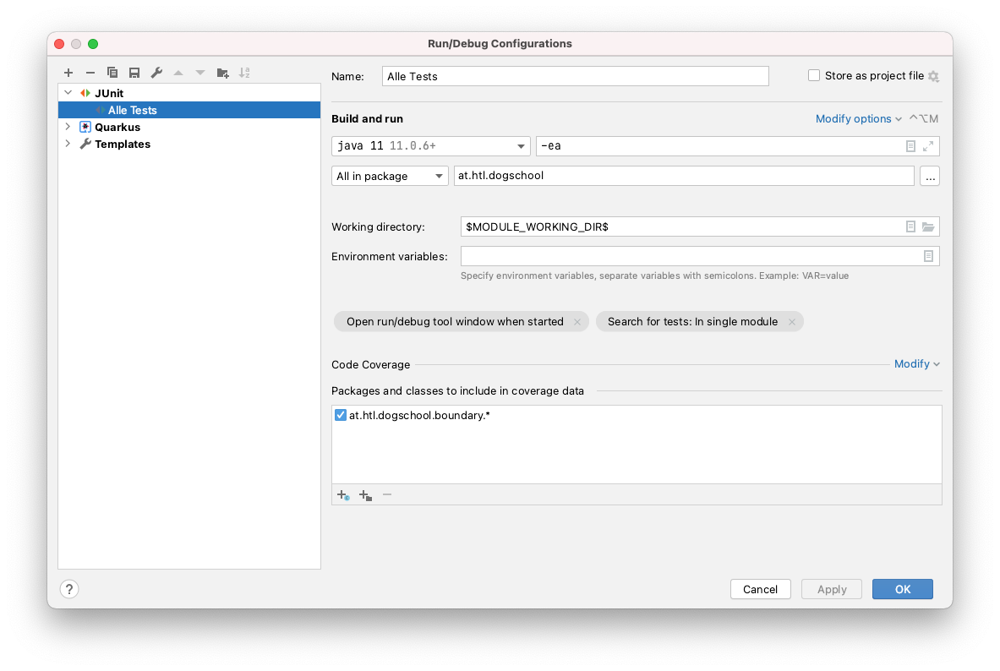
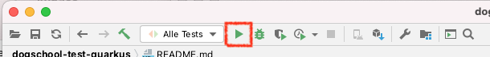
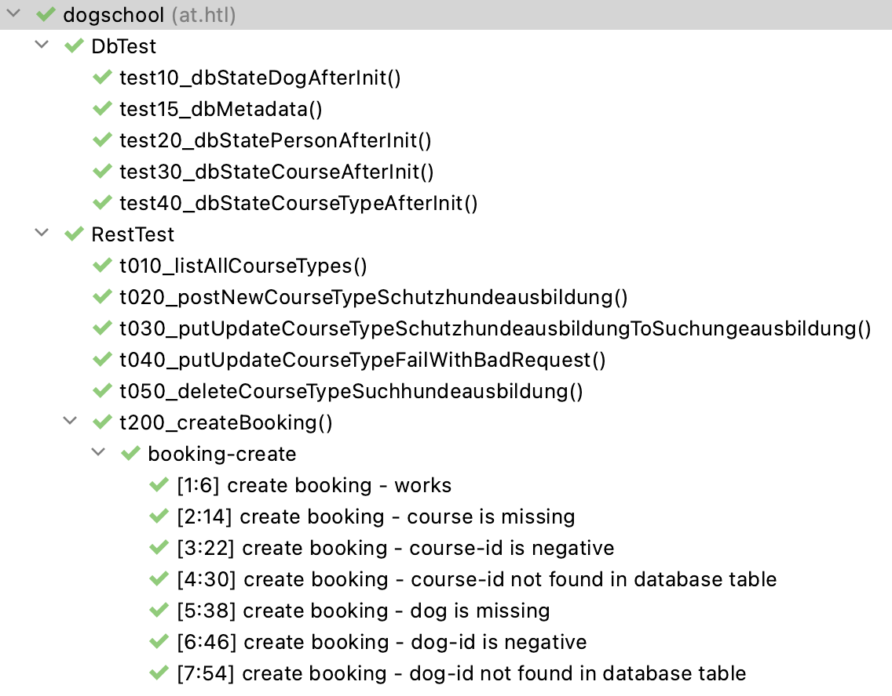

# dogschool-test-quarkus project

- Dies ist das Tesprojekt für das dogschool-project (Quarkus)
- Nachfolgend werden folgende Begriffe verwendet:
  - DogSchool-Projekt: Ihr DogSchool-Projekt (die Leistungsfeststellung)
  - Testprojekt: Dieses Projekt mit den System-Tests  
- Beide Projekte (DogSchool-Projekt und Testprojekt) werden vom github ge-cloned

## Wie verwendet man dieses Test-Projekt?

1. Zuerst führen Sie ein checkout Ihres DogSchool-Projektes durch.

2. Starten Sie die Datenbank in Ihrem DogSchool-Projekt

3. Starten Sie Ihr DogSchool-Projekt mit

```
./mvnw clean compile quarkus:dev
```

4. Konfigurieren Sie im Testprojekt die Testausführung wie folgt:



5. Starten Sie nun die Testausführung (Alternativ können die Tests mit `./mvnw clean test` gestartet werden)



  - Das Testprojekt ist so konfiguriert, dass das laufende DogSchool-Projekt getestet wird (Port 8080)
  - Es wird zum testen *keine* eigene Quarkus-Instanz erstellt.

6. Nun sollten Sie folgendes Ergebnis sehen:



